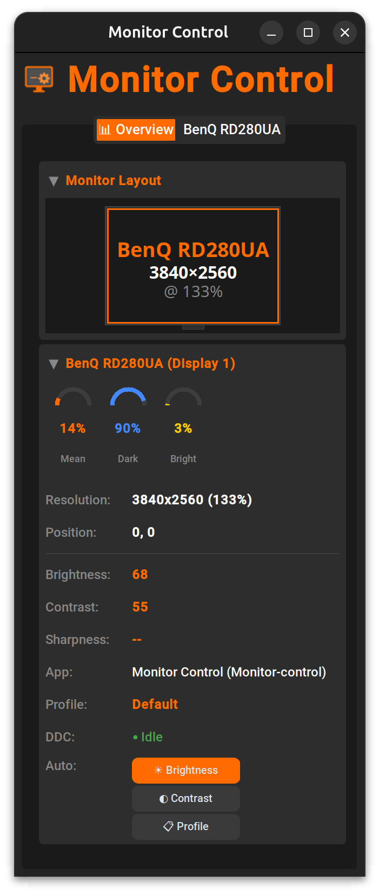
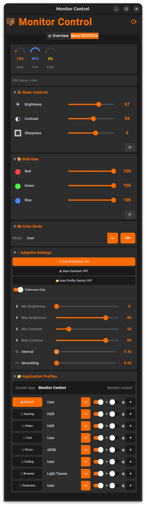

# Monitor Control

<p align="center">
  
</p>

**DDC/CI Monitor Control for Linux** - A desktop application to control your monitor's brightness, contrast, color modes, and RGB gain via DDC/CI protocol.

Designed for the **BenQ RD280UA** but works with any DDC/CI compatible monitor.


## Features

- 🎛️ **Modern GUI** - CustomTkinter-based overlay with dark theme
- 🖥️ **Multi-Monitor Support** - Switch between monitors from a dropdown in the GUI, with separate config files per monitor
- 🔄 **Automatic Profile Switching** - Change settings based on active application (IDE, browser, video player, etc.) - **per-monitor**: only triggers for windows on that monitor
- ☀️ **Adaptive Brightness** - Automatically adjust brightness based on screen content (inverse - bright content = lower brightness) - analyzes only the controlled monitor's area
- 📊 **Adaptive Contrast** - Automatically adjust contrast based on screen darkness - analyzes only the controlled monitor's area
- 🎨 **Color Mode Control** - Switch between monitor color presets (automatically detected from DDC capabilities)
- 🔴🟢🔵 **RGB Gain Control** - Fine-tune red, green, and blue color channels (in User mode)
- 💾 **Persistent Settings** - All settings saved to config file and restored on startup
- ⚡ **Per-Profile Auto Settings** - Enable/disable auto brightness/contrast per application profile

## Screenshot




The GUI provides:
- Brightness & Contrast sliders (0-100)
- Sharpness control
- RGB Gain sliders (Red, Green, Blue)
- Color mode dropdown
- Adaptive brightness/contrast controls with interval and smoothing
- Application profile management

## Installation

### Prerequisites

1. **Install ddcutil** (required for DDC/CI communication):
   ```bash
   # Ubuntu/Debian
   sudo apt install ddcutil i2c-tools
   
   # Fedora
   sudo dnf install ddcutil i2c-tools
   
   # Arch
   sudo pacman -S ddcutil i2c-tools
   ```

2. **Load I2C kernel module**:
   ```bash
   sudo modprobe i2c-dev
   
   # Make it permanent:
   echo "i2c-dev" | sudo tee /etc/modules-load.d/i2c-dev.conf
   ```

3. **Add user to i2c group** (to avoid running as root):
   ```bash
   sudo usermod -aG i2c $USER
   # Log out and back in for changes to take effect
   ```

4. **Enable DDC/CI on your monitor** - Check your monitor's OSD settings menu

### Install Monitor Control

```bash
# Clone the repository
git clone https://github.com/Pink-o/monitor-control.git
cd monitor-control

# Copy example config (optional - app creates default on first run)
cp config.yaml.example config.yaml

# Create virtual environment
python3 -m venv venv
source venv/bin/activate

# Install dependencies
pip install -r requirements.txt

# Run the application
python main.py
```

### Desktop Integration (Optional)

```bash
# Copy desktop file to applications
cp monitor-control.desktop ~/.local/share/applications/

# Update the Exec path in the desktop file to point to your installation
```

## Usage

### GUI Mode (Default)

```bash
python main.py
```

### Command Line Options

```bash
# Detect monitors
python main.py --detect

# Show monitor capabilities (VCP codes)
python main.py --capabilities

# Set brightness directly
python main.py --brightness 50

# Set contrast directly  
python main.py --contrast 60

# Run without GUI (daemon mode)
python main.py --no-gui

# Debug logging
python main.py --debug
```

### Configuration

Configuration is split into two types:

1. **Global Config** (`~/.config/monitor-control/config.yaml`) - Profiles, application settings, and default color mode names
2. **Per-Monitor Config** (`~/.config/monitor-control/monitors/<monitor_id>.yaml`) - Monitor-specific settings like color modes, brightness, contrast

Per-monitor config files are created automatically when you connect a new monitor. The monitor ID is derived from the model and serial number (e.g., `BenQ_RD280UA_ABC12345.yaml`).

#### Global Config

A default configuration is created on first run. Key sections:

```yaml
# Monitor display number (run --detect to find yours)
display: 1

# Color modes mapping (name -> VCP value)
color_modes:
  User: 18
  sRGB: 1
  Cinema: 34
  HDR: 32
  # ... etc

# Application profiles
profiles:
  coding:
    window_class: ["code", "cursor", "jetbrains"]
    color_preset: User
    auto_brightness: false
    auto_contrast: false
    
  video:
    window_class: ["vlc", "mpv"]
    window_title: ["YouTube", "Netflix"]
    require_fullscreen: true
    color_preset: Cinema
    auto_brightness: true

# Adaptive brightness/contrast settings
adaptive_contrast:
  enabled: true
  interval: 1.0        # Analysis interval in seconds (0.1-3.0)
  smoothing: 0.2       # Smoothing factor (0.0-1.0)
  min_brightness: 10
  max_brightness: 80
  min_contrast: 30
  max_contrast: 70
```

#### Per-Monitor Config

Each monitor gets its own config file with settings specific to that display:

```yaml
# ~/.config/monitor-control/monitors/BenQ_RD280UA_ABC12345.yaml
monitor_id: BenQ_RD280UA_ABC12345
color_modes:
  Cinema: 50
  Dark Theme: 48
  HDR: 35
  Light Theme: 49
  M-book: 15
  User: 18
  ePaper: 31
  sRGB: 10
settings:
  brightness: 50
  contrast: 50
  color_preset: 18
  red_gain: 100
  green_gain: 100
  blue_gain: 100
adaptive: {}
```

Color modes are automatically detected from the monitor's DDC capabilities and named using the global config's color_modes mappings.

## BenQ RD280UA Color Modes

| VCP Value | Monitor Label | Config Name |
|-----------|---------------|-------------|
| 18 | User | User |
| 1 | sRGB | sRGB |
| 34 | Cinema | Cinema |
| 32 | HDR | HDR |
| 49 | Light Theme | Light Theme |
| 48 | Dark Theme | Dark Theme |
| 2 | M-book | M-book |
| 11 | ePaper | ePaper |

> **Note:** RGB Gain (Red/Green/Blue) can only be adjusted when the monitor is set to **User** color mode.

## Per-Monitor Features

The application handles multi-monitor setups intelligently:

### Automatic Profile Switching (Per-Monitor)
- **Window position detection** - Uses xrandr to determine monitor geometries and window positions
- **Monitor-specific triggers** - Profile changes only apply when the active window is on the controlled monitor
- Example: Clicking a browser on Monitor 2 won't change Monitor 1's profile

### Adaptive Brightness/Contrast (Per-Monitor)
- **Region-based capture** - Screen analysis captures only the controlled monitor's area
- **Independent settings** - Each monitor can have auto brightness/contrast enabled/disabled independently
- Settings are saved to each monitor's config file

### How It Works
1. On startup, the app queries `xrandr` for monitor positions (e.g., `5118x3412+0+0`)
2. DDC display numbers are mapped to xrandr outputs via DRM connector names
3. When a window receives focus, its center point is checked against monitor geometries
4. Screen analysis uses the exact geometry bounds for accurate per-monitor capture

## Architecture

```
monitor-control/
├── main.py                    # Application entry point
├── config.yaml                # Default configuration
├── requirements.txt           # Python dependencies
├── monitor_control/
│   ├── ddc.py                 # DDC/CI communication via ddcutil + xrandr geometry
│   ├── config.py              # Configuration management (global + per-monitor)
│   ├── window_monitor.py      # Active window detection (X11/Wayland hybrid)
│   ├── screen_analyzer.py     # Screen brightness analysis (mss/flameshot/gnome-screenshot)
│   ├── profile_manager.py     # Profile matching + per-monitor filtering
│   └── gui/
│       └── overlay_ctk.py     # CustomTkinter GUI
├── patches/
│   ├── gnome-screenshot-silent.patch  # Patch to disable screen flash
│   └── build-gnome-screenshot-silent.sh  # Build script for Wayland
└── assets/
    └── icon*.png              # Application icons
```

## Troubleshooting

### "No monitors detected"

1. Check DDC/CI is enabled in monitor OSD settings
2. Verify i2c-dev module is loaded: `lsmod | grep i2c`
3. Check I2C devices exist: `ls /dev/i2c-*`
4. Test with ddcutil directly: `ddcutil detect`

### "Permission denied" accessing I2C

```bash
# Add user to i2c group
sudo usermod -aG i2c $USER
# Log out and back in
```

### RGB Gain not working

RGB Gain can only be changed when the monitor is in **User** color mode. Other color presets lock the RGB values.

### Monitor not responding to commands

- Some monitors need delays between DDC commands
- Try increasing the interval between commands
- Check if your monitor supports the specific VCP code

## Wayland Support

The application works on both **X11** and **Wayland**, but with some differences due to Wayland's stricter security model.

### What Works on Wayland

| Feature | Status | Notes |
|---------|--------|-------|
| DDC/CI Control | ✅ Full | Brightness, contrast, color modes, RGB gain |
| Multi-Monitor | ✅ Full | Per-monitor configs and settings |
| Application Profiles | ✅ Full | Automatic switching based on active window |
| Window Detection | ✅ Full | Uses AT-SPI + libwnck hybrid approach |
| GUI | ✅ Full | CustomTkinter works natively |

### What Requires Extra Setup on Wayland

| Feature | Status | Notes |
|---------|--------|-------|
| Adaptive Brightness/Contrast | ⚠️ Requires screenshot tool | See below |
| Screen Analysis | ⚠️ Requires screenshot tool | See below |

### Enabling Adaptive Brightness on Wayland

Wayland's security model prevents applications from capturing the screen directly. You need to install a screenshot tool that supports Wayland:

#### Option 1: Build Silent gnome-screenshot (GNOME - Recommended)

For a truly silent experience on GNOME Wayland (no screen flash), use the included build script:

```bash
# Navigate to monitor-control directory
cd /path/to/monitor-control

# Run the build script (installs to /usr/local/bin/gnome-screenshot-silent)
./patches/build-gnome-screenshot-silent.sh
```

The script will:
1. Check and report missing dependencies
2. Clone gnome-screenshot from GNOME GitLab
3. Apply our patch to disable screen flash
4. Build and install to `/usr/local/bin/gnome-screenshot-silent`

**Build Dependencies (Ubuntu/Debian):**
```bash
sudo apt install meson ninja-build gcc pkg-config git \
                 libgtk-3-dev libhandy-1-dev libportal-dev \
                 libportal-gtk3-dev gettext itstool
```

**Build Dependencies (Fedora):**
```bash
sudo dnf install meson ninja-build gcc pkg-config git \
                 gtk3-devel libhandy-devel libportal-devel \
                 libportal-gtk3-devel gettext itstool
```

**What the patch does:**
The patch applies several optimizations for fast, silent screen capture:
1. **Disables screen flash** - No visual disruption during capture
2. **Fast PNG compression** (level 1) - Faster encoding than default
3. **Downscales to 1/4 size** - Reduces file from ~5MB to ~600KB (e.g., 6240x2560 → 1560x640)
4. **NEAREST interpolation** - Fastest scaling algorithm

These optimizations make captures significantly faster while preserving enough detail for accurate brightness analysis.

**How the app detects it:**
The app automatically checks for the silent version before falling back to standard gnome-screenshot. It looks in this order:
1. `/usr/local/bin/gnome-screenshot-silent` (permanent install)
2. `/tmp/gnome-screenshot-silent` (temporary/testing)
3. `gnome-screenshot` (system default, has flash)

No configuration needed - just build and install, the app will use it automatically.

#### Option 2: Flameshot (Universal - Works on GNOME & KDE)

```bash
# Ubuntu/Debian
sudo apt install flameshot

# Fedora
sudo dnf install flameshot

# Arch
sudo pacman -S flameshot
```

> **Note:** Flameshot may show a brief flash notification on each capture.

#### Option 3: gnome-screenshot (GNOME only - has flash)

```bash
# Ubuntu/Debian
sudo apt install gnome-screenshot
```

> **Note:** Standard gnome-screenshot shows a screen flash on each capture, which can be distracting.

#### Option 4: grim (Sway/wlroots only)

```bash
# For Sway and other wlroots-based compositors
sudo apt install grim
```

#### Option 5: spectacle (KDE only)

```bash
# KDE Plasma
sudo apt install spectacle
```

### Wayland Window Monitoring Dependencies

For window detection on Wayland, install these optional dependencies:

```bash
# AT-SPI for native Wayland apps (recommended)
sudo apt install python3-gi gir1.2-atspi-2.0

# libwnck for XWayland apps (recommended)
sudo apt install gir1.2-wnck-3.0
```

### Wayland Troubleshooting

#### "All screen capture methods failed"

Install one of the screenshot tools listed above. The app tries them in order:
1. `/tmp/gnome-screenshot-silent` or `/usr/local/bin/gnome-screenshot-silent` (custom silent build)
2. `flameshot` (universal)
3. `gnome-screenshot` (GNOME)
4. `grim` (wlroots/Sway)
5. `spectacle` (KDE)

#### Window detection not working

1. Enable accessibility services in GNOME Settings → Accessibility
2. Install AT-SPI: `sudo apt install gir1.2-atspi-2.0`
3. For XWayland apps, install libwnck: `sudo apt install gir1.2-wnck-3.0`

#### Screen capture shows black image

Some Wayland compositors require permission grants. On GNOME, the first screenshot may trigger a permission dialog.

## API Usage

```python
from monitor_control.ddc import DDCController

# Create controller for display 1
ddc = DDCController(display=1)

# Get/set brightness
brightness = ddc.get_brightness()
ddc.set_brightness(50)

# Get/set contrast
contrast = ddc.get_contrast()
ddc.set_contrast(60)

# Get/set color preset
ddc.set_color_preset(18, "User")

# Get all settings at once
settings = ddc.get_all_settings()
# Returns: {'brightness': 50, 'contrast': 60, 'color_preset': 18, 
#           'red_gain': 100, 'green_gain': 100, 'blue_gain': 100}
```

## Dependencies

### Required
- **ddcutil** - DDC/CI command-line tool
- **Python 3.8+**
- **customtkinter** - Modern themed Tkinter widgets
- **PyYAML** - Configuration file parsing
- **Pillow** - Image processing
- **numpy** - Screen brightness calculations

### X11 (Optional)
- **python-xlib** - X11 window monitoring (native)
- **mss** - Screenshot capture for screen analysis (silent)

### Wayland (Optional)
- **python3-gi** + **gir1.2-atspi-2.0** - AT-SPI for native Wayland window monitoring
- **gir1.2-wnck-3.0** - libwnck for XWayland window monitoring
- **flameshot** / **gnome-screenshot** / **grim** / **spectacle** - Screenshot tool for adaptive brightness

## License

MIT License - See [LICENSE](LICENSE) file for details.

## Acknowledgments

- [ddcutil](https://www.ddcutil.com/) - The excellent DDC/CI tool this project relies on
- [CustomTkinter](https://github.com/TomSchimansky/CustomTkinter) - Modern Python UI library
- BenQ for making monitors with good DDC/CI support
